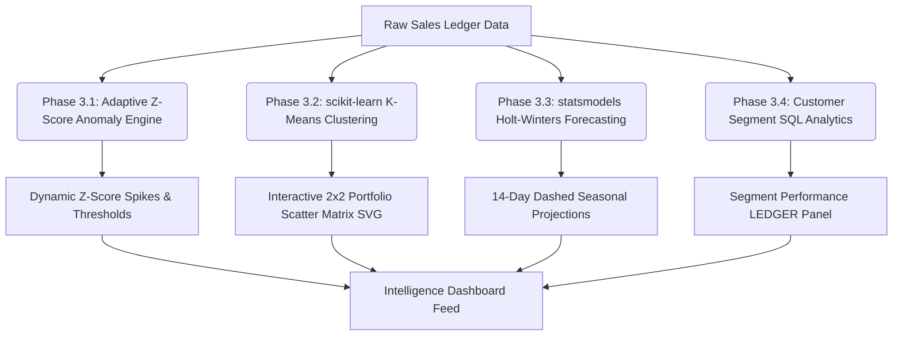

# Implementation Plan — Phase 3: Machine Learning & Analytics Layer

This document details the exact, step-by-step engineering roadmap for Phase 3 of **RetailMind** (the Machine Learning and Analytics Layer). It provides clear technical specifications, mathematical foundations, and concrete code blueprints so other developers and stakeholders can easily track, review, and follow our execution path.

---

## 📅 Architecture & Data Flow Overview

The diagram below outlines how raw transaction ledger data flows through our four specialized analytics modules to drive custom, premium frontend visualizations and notifications.



---

## Phase 3.1: Adaptive Z-Score Anomaly Engine

### 1. Goal
Replace the rigid, hardcoded $1.5\times$ multiplier threshold for demand spikes with an **adaptive Z-score model** that dynamically tailors itself to each product's natural volatility. This drastically minimizes false alerts for volatile items while highlighting true anomalies for consistent, low-variance stock.

### 2. Mathematical Definition
We evaluate each product's historical weekly volume over a rolling 12-week window. Let $Q_t$ represent the quantity sold in week $t$.

1. **Mean Weekly Volume ($\mu$):**
   $$\mu = \frac{1}{N} \sum_{i=1}^{N} Q_{t-i}$$
2. **Standard Deviation ($\sigma$):**
   $$\sigma = \sqrt{\frac{1}{N} \sum_{i=1}^{N} (Q_{t-i} - \mu)^2}$$
3. **Z-Score of Current Week ($Z$):**
   $$Z = \frac{Q_{\text{current}} - \mu}{\sigma}$$

An anomaly is flagged if $Z > 2.0$ (representing the $95$th percentile of normal product volatility).

### 3. Step-by-Step Backend Blueprint
Modify `get_retail_summary` in [retail_intelligence.py](file:///d:/CODING/documind/backend/app/services/retail_intelligence.py):
* Retrieve daily transaction quantities per product for the last 90 days.
* Group sales data into weekly bins (7-day intervals).
* Loop through products:
  * If the product has at least 4 active weeks of data and $\sigma > 0.1$:
    * Compute the current week's volume, rolling mean, standard deviation, and Z-score.
    * If $Z > 2.0$, construct a spike alert.
  * **Defensive Fallback:** If the product has $<4$ active weeks of sales or $\sigma \le 0.1$, fall back to a simple $1.5\times$ rolling average ratio to ensure young SKU coverage.
* Append details to the payload: `{"product_name": str, "type": "spike", "z_score": float, "message": str, "recent_qty": float}`.

### 4. Frontend Integration
Modify `DemandSignals.jsx` to render the Z-score and standard deviation:
```javascript
// Render template snippet
<span className="telex-stamp-badge red-stamp">SPIKE ALERT</span>
<span className="monospace-text">
  {signal.product_name} registered a significant demand surge: 
  Z-score of {signal.z_score.toFixed(2)} (+{signal.deviation_pct}% deviation).
</span>
```

---

## Phase 3.2: Product Clustering ($K$-Means)

### 1. Goal
Auto-segment the store's product portfolio using unsupervised clustering into four performance quadrants: **Stars**, **Cash Cows**, **Hidden Gems**, and **Dead Weight**. This gives owners an immediate, automated product-mix playbook.

### 2. Algorithmic Dimensions & Normalization
For every active SKU, extract four numerical features over the selected period:
1. **Revenue ($R$):** Blended revenue generated by the SKU.
2. **Gross Margin Percentage ($M$):** Weighted average gross profit margin.
3. **Velocity ($V$):** Blended quantity sold.
4. **Recency ($Re$):** Days since the most recent sale.

We use `StandardScaler` from `scikit-learn` to normalize each dimension to prevent high-revenue scale distortions:
$$X_{\text{std}} = \frac{X - \mu_x}{\sigma_x}$$

### 3. $K$-Means Centroid & Quadrant Mapping
Fit a $K$-Means clustering model:
```python
from sklearn.cluster import KMeans
kmeans = KMeans(n_clusters=4, random_state=42, n_init='auto')
```
Once clusters are assigned, compute each cluster's centroid vector $(\bar{R}, \bar{M}, \bar{V}, \bar{Re})$ in normalized space and map them to standard business names:
* 🌟 **Stars:** High revenue ($\bar{R} > 0$), high margin ($\bar{M} > 0$), high volume, low recency days.
* 💎 **Hidden Gems:** Low/med revenue ($\bar{R} < 0$), high margin ($\bar{M} > 0$), low/med volume.
* 🐄 **Cash Cows:** High revenue ($\bar{R} > 0$), low/med margin ($\bar{M} < 0$), high volume.
* 🪨 **Dead Weight:** Low revenue ($\bar{R} < 0$), low margin ($\bar{M} < 0$), low volume, high recency days.

### 4. API Endpoint (`GET /api/v1/retail/portfolio-clusters`)
Create a new router endpoint inside `app/api/retail.py` returning:
```json
{
  "clusters": [
    {
      "product_name": "Premium Broadleaf Journal",
      "quadrant": "Stars",
      "coordinates": { "x": 0.85, "y": 0.92 },
      "metrics": { "revenue": 45000, "margin_pct": 65, "qty": 700 }
    }
  ],
  "centroids": {
    "Stars": { "x": 0.72, "y": 0.81 },
    "Hidden Gems": { "x": -0.42, "y": 0.75 },
    "Cash Cows": { "x": 0.65, "y": -0.31 },
    "Dead Weight": { "x": -0.55, "y": -0.62 }
  }
}
```

### 5. Frontend Interactive Chart Component (`PortfolioMatrix.jsx`)
Create a new component [PortfolioMatrix.jsx](file:///d:/CODING/documind/frontend/src/components/PortfolioMatrix.jsx):
* **Custom 2x2 SVG Scatter Grid:** Renders four quadrants with heavy double-rules matching the broadsheet newspaper aesthetic.
* **SVG Coordinate Projection:** Plots products as hoverable circular nodes. Hovering renders an authentic Courier typewriter tooltip.
* **Table Interactivity:** Clicking a quadrant (e.g. *Dead Weight*) automatically emits an event that filters the main product ledger table to inspect the matching SKUs instantly.

---

## Phase 3.3: Holt-Winters Exponential Smoothing

### 1. Goal
Upgrade the demand forecasting framework to detect daily and weekly seasonal cycles (e.g., weekend spikes and mid-week dips) using triple exponential smoothing.

### 2. Mathematical Definition
We use the additive Holt-Winters model consisting of a level ($l_t$), trend ($b_t$), and weekly seasonal factor ($s_t$) where the seasonal cycle is $p = 7$:
$$\hat{y}_{t+h|t} = l_t + h b_t + s_{t+h-p(k+1)}$$
* **Level Update:** $l_t = \alpha (y_t - s_{t-p}) + (1 - \alpha)(l_{t-1} + b_{t-1})$
* **Trend Update:** $b_t = \beta (l_t - l_{t-1}) + (1 - \beta)b_{t-1}$
* **Seasonal Update:** $s_t = \gamma (y_t - l_{t-1} - b_{t-1}) + (1 - \gamma)s_{t-p}$

### 3. Step-by-Step Backend Blueprint
Modify `get_demand_forecast` in `retail_intelligence.py`:
* **Reconstruct Timeseries:** For each product, extract daily sales quantities. Reconstruct a dense date range spanning 90 days. Fill missing sales days with `0.0` to preserve accurate time-series continuity.
* **Fit Holt-Winters:**
  ```python
  from statsmodels.tsa.holtwinters import ExponentialSmoothing
  model = ExponentialSmoothing(
      history_series,
      seasonal_periods=7,
      trend="add",
      seasonal="add"
  ).fit(optimized=True)
  forecast = model.forecast(14)
  ```
* **Defensive Fallback:** Training Holt-Winters requires sufficient dense history. If a product has less than 90 days of transactions or sparse sales ($\le 15$ active days), fall back to the Phase 2 rolling average (v1) forecast.

### 4. Frontend Projection Overlay
Update `SalesTrendGraph.jsx`:
* Extend the Sales Trend SVG chart area to support future projections.
* Plot the 14-day forecasted trend as an elegant, dashed navy line path with a halftone shade area beneath it to differentiate historical data from predictive models.

---

## Phase 3.4: Customer Segment Analytics

### 1. Goal
Track and isolate performance metrics across Walk-in, Online, and high-volume B2B wholesale buyers to let business owners target high-value customer acquisitions.

### 2. Database Aggregations (FastAPI / SQL)
Perform high-efficiency SQL group-by operations inside `get_retail_summary`:
* Group by `SaleRecord.customer_segment` (Walk-in / Online / B2B).
* Compute metrics:
  * **Revenue & COGS** totals.
  * **Blended Margin %:** $\frac{\text{Revenue} - \text{COGS}}{\text{Revenue}} \times 100$.
  * **Average Order Value (AOV):** $\frac{\text{Total Revenue}}{\text{Number of Unique Orders}}$.
  * **Revenue Contribution Share:** Blended segment revenue divided by total revenue.
  * **Month-over-Month Growth %** of revenue per segment.

### 3. Frontend Ledger Panel (`CustomerSegmentsPanel.jsx`)
Create a new component [CustomerSegmentsPanel.jsx](file:///d:/CODING/documind/frontend/src/components/CustomerSegmentsPanel.jsx):
* Renders as a vintage broadsheet double-ruled ledger section.
* Shows custom horizontal SVG progress bars reflecting each segment's contribution share.
* Incorporates inline telex-stamped tags highlighting B2B vs Storefront metrics.

---

## 🧪 Verification & Automated Testing Plan

To ensure maximum software reliability and zero regressions, we will enforce a strict dual verification framework:

### 1. Automated Test Suite (`backend/scripts/test_ml_layer.py`)
We will write a comprehensive test suite using the native SQLite database context.
* **Test Case A (Z-Score):** Verify that Z-Scores are correctly calculated and that high-variance products raise spikes when appropriate. Ensure standard deviation boundary conditions (e.g. standard deviation = 0) fall back gracefully.
* **Test Case B (K-Means):** Assert that K-Means assigns exactly 4 unique quadrants when given high-fidelity seeder data. Ensure that empty/null coordinates are caught and handled.
* **Test Case C (Holt-Winters):** Ensure Holt-Winters fitting succeeds for dense products, forecasts exactly 14 days into the future, and falls back to rolling average when historical sales are $<90$ days.
* **Test Case D (Segment SQL):** Verify grouped aggregations produce correct blended margins and matching mathematical contribution shares.

### 2. Manual Verification Checklist
* Verify the SVG 2x2 matrix hovers show correct metrics inside typewriter tooltips.
* Click on the "Hidden Gems" quadrant and verify that the product table below correctly filters to display only high-margin, low-volume SKUs.
* Switch tabs in `SalesTrendGraph.jsx` and inspect the forecasted seasonal dashed path. Ensure that mobile layouts scale correctly.

---

## 📅 Phased Execution Checklist

```markdown
- [ ] Phase 3.1: Adaptive Z-Score Anomaly Engine
  - [ ] Implement standard deviation and rolling window mean calculations in `retail_intelligence.py`.
  - [ ] Update spike flags and dynamic Z-score calculations.
  - [ ] Update frontend `DemandSignals.jsx` to render Z-score metadata.
- [ ] Phase 3.2: Product Portfolio Clustering (K-Means)
  - [ ] Implement feature extraction (revenue, margin, velocity, recency) and standardize inputs.
  - [ ] Fit `KMeans(n_clusters=4)` and map centroids to business quadrants.
  - [ ] Create `GET /api/v1/retail/portfolio-clusters` router endpoint.
  - [ ] Build the interactive SVG `PortfolioMatrix.jsx` scatter grid component and integrate filters.
- [ ] Phase 3.3: Holt-Winters Exponential Smoothing
  - [ ] Construct continuous daily time series per product with filled 0.0 values.
  - [ ] Fit statsmodels `ExponentialSmoothing` and predict 14 days.
  - [ ] Design defensive fallback structure for products with scarce history.
  - [ ] Render dashed prediction path forward on frontend line charts.
- [ ] Phase 3.4: Customer Segment Analytics
  - [ ] Write SQL aggregations grouped by segment with blended margins, AOV, and MoM rates.
  - [ ] Create the vintage-style `CustomerSegmentsPanel.jsx` component.
  - [ ] Mount the segment metrics panel on the dashboard.
- [ ] Phase 3.5: Test Suite & Verification
  - [ ] Create and run `backend/scripts/test_ml_layer.py`.
  - [ ] Perform responsive layout verification audits.
```
